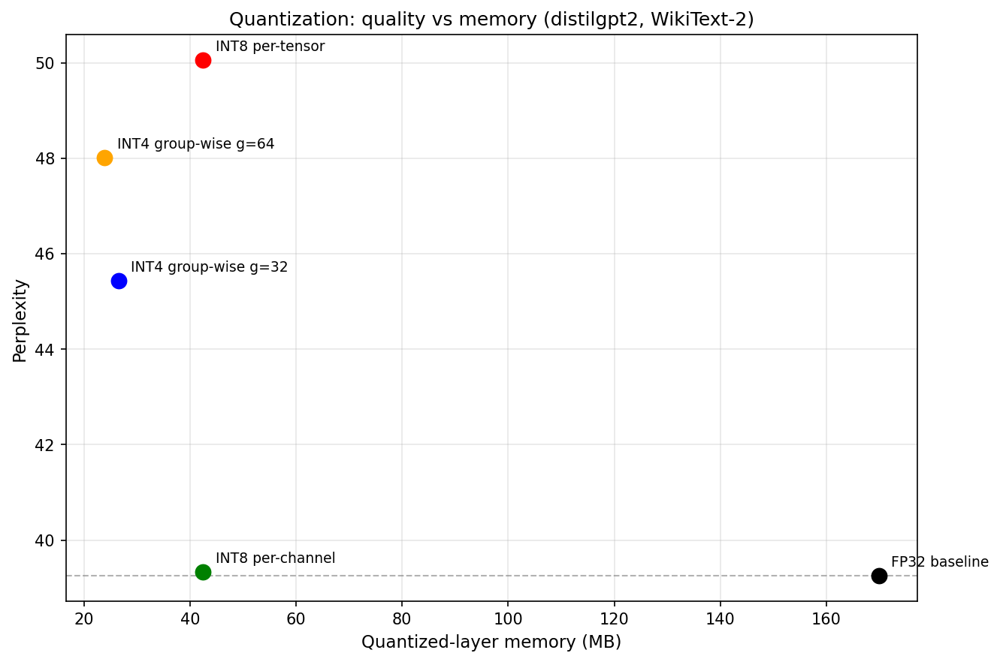

# Quantizing a Language Model From Scratch

Implementing INT8 and INT4 weight quantization for a transformer language model **from scratch** (No `bitsandbytes` or quantization libraries for the core mechanism) and measuring the quality vs memory tradeoff across levels on distilgpt2.

The plot above is the whole project in one glance: **lower left is better** (small **and** accurate). 

The headline finding is the vertical gap between the two INT8 points, same bits and same size, but widely different quality and the fact that a well designed 4-bit model beats a naive 8-bit one with the group size determining its own tradeoffs.

---

## What this project does

Language models store their weights in 32-bit floats (FP32). Quantization shrinks them to fewer bits (INT8, INT4) to save memory. This project implements the quantization math by hand and answers one question: **how much does the precision loss actually hurt the model, and how does the design of the quantization scheme change that?**

I use **simulated ("fake") quantization**: weights are rounded to the INT8/INT4 grid reproducing the *exact* precision loss of real quantization but kept in FP32 for storage so the model runs with standard PyTorch. This isolates the **quality cost** of quantization from the separate systems problem of writing custom low precision GPU kernels. The accuracy results are identical to real quantization; only the memory/speed benefit is computed rather than realised.

- **Model:** distilgpt2
- **Eval:** perplexity on WikiText-2 (test split), computed with a sliding-window (1024-token context, 512 stride, masked overlap so each token is scored once with full context)
- **Quantized layers:** the linear weight matrices in attention and MLP blocks (`c_attn`, `c_proj`, `c_fc`); embeddings and LayerNorm are left in full precision

---

## Results

| Scheme | Bits | Perplexity | Δ vs FP32 | Quantized-layer size |
|---|---|---|---|---|
| FP32 baseline | 32 | 39.26 | — | 169.87 MB |
| INT8 per-tensor | 8 | 50.05 | +10.79 | 42.47 MB |
| INT8 per-channel | 8 | 39.33 | +0.08 | 42.47 MB |
| INT4 group-wise (g=64) | 4 | 48.01 | +8.75 | 23.89 MB |
| INT4 group-wise (g=32) | 4 | 45.43 | +6.18 | 26.54 MB |

**Key findings:**

1. **How you quantize matters more than how many bits you use.** INT8 per channel recovers 99% of the quality lost by naive INT8 per tensor (+0.08 vs +10.79) for the *same* 8 bits and the *same* size. The entire difference is granularity of the scale.
2. **A well designed 4 bit model beats a careless 8 bit one.** INT4 groupwise (48.01) is both smaller *and* more accurate than INT8 per tensor (50.05), using half the bits.
3. **INT8 per channel is the optimal spot:** 4× smaller for essentially no quality loss.
4. **4 bit quality is tunable.** Halving the group size (64 to 32) recovers 2.58 perplexity at a predictable, linear scale storage cost (2.65 MB to 5.31 MB).

---

## Theory & methods

### General quantization

Quantization converts high-precision data into low-precision data — for example, floating-point values mapped onto integers. This lightens the computational load required to run the model, and is the single most powerful lever for fitting a model onto given hardware. 

**Quantization formula**

x_q = clip(round( x / S ) + Z , q_min , q_max)

where:

- `x` — the original floating point value.
- `S` (scale) — how much floating point range is packed into a single integer step: `S = float range width / integer range width`. The float and integer ranges depend on the type of quantization.
- `Z` (zero point) — aligns the floating point value `0.0` with an exact integer, so zero is represented without error. This matters because zero occurs disproportionately often in neural network tensors (padding, ReLU activations, sparsity), and an inexact representation of it introduces systematic bias. The zero-point is the main factor that distinguishes the two quantization types.
- `round()` — rounds to the nearest integer.
- `clip()` or `clamp()` — constrains the result to the representable interval so out of range values saturate at the endpoints rather than overflowing.
- `q_min` / `q_max` — the endpoints of the target bit range (e.g. −128 / 127 for INT8).

**Dequantization formula**

x' = S ( x_q − Z )

The recovered value `x'` approximates `x` rather than reproducing it exactly. The difference `x' − x` is the **quantization error**, and analysing it is how accuracy loss is examined.

Two quantization types differ in how `S` and `Z` are set:

- **Affine (asymmetric):** maps the raw tensor's min and max directly onto the integer range, so `Z != 0` and the range is shifted. Appropriate when the distribution is not centred on zero. `S = (x_max − x_min) / (q_max − q_min)` (denominator 255 for INT8, 15 for INT4) where `x_min` and `x_max` are the minimum and maximum of the raw tensor respectively.
- **Symmetric:** restricts `Z = 0` (see below). The standard choice for weight quantization and **what this project uses**.

### Symmetric quantization

Symmetric quantization restricts the zero-point to always equal zero (`Z = 0`), so the range is always centred on 0. The float range is found from the absolute maximum value in the tensor, `|x|_max` making the scale:

S = |x|_max / q_max          
(q_max = 127 for INT8, 7 for INT4 (signed))

Standard symmetric quantization maps to a balanced range `[−q_max, q_max]` (dividing by `q_max` to keep zero perfectly centred). Symmetric is the standard choice for weight tensors because it makes the arithmetic simple, increasing speed and cutting the memory overhead the zero point would otherwise add.

### The outlier problem, and per channel as the fix

The scale `S` is the grid's step size, and because `S = |x|_max / q_max` it is set by the single largest magnitude weight. One outlier inflates `|x|_max`, which coarsens `S` for **every** weight sharing that scale, so small weights get snapped clumsily onto a few nearby integer codes (some rounded to zero). 

The remedy is **granularity**: reducing the number of values governed by a single scale.

- **Per tensor** — one `S` for the whole matrix. The baseline scheme which suffers the outlier problem in full: a single anomalous value degrades the entire matrix.
- **Per channel** — a separate `S` per output channel (row/column). An outlier is confined to its own channel's grid; the rest are unaffected. It *contains* the problem rather than eliminating it. An outlier still hurts the small weights sharing its channel which is why per channel is **not perfectly lossless**. **Standard for INT8**.

Measured on a real weight matrix, the mean rounding error dropped ~10x moving from per tensor to per channel (0.0103 to 0.0011).
- Implementation note: distilgpt2 uses `Conv1D` layers which store weights transposed relative to `nn.Linear` (`[in, out]` instead of `[out, in]`). Per channel quantization therefore reduces along the correct axis so each `S` corresponds to an **output** channel.

### Groupwise scales for INT4

INT4 has only ~15 grid levels (vs 255 for INT8), so a whole channel sharing one `S` is too coarse. **Groupwise** quantization subdivides each channel into small contiguous groups (eg. 64 weights) and gives each group its own `S` shrinking the range each scale must cover until 15 levels suffice. Isolation is maximised; An outlier corrupts only its own small group. This is what makes 4-bit viable and is the standard for INT4.

Group size is the deciding factor: smaller groups mean better quality but at the cost of more scale overhead (many more `S` values to store). 
Comparing `group_size = 64` against `group_size = 32`, perplexity improves (+8.75 vs +6.18) while memory also increases (23.89 MB (7.11x smaller) to 26.54 MB (6.40x smaller)) due to scale overheads (2.65 MB vs 5.31 MB).

### Bit packing

A byte is the smallest addressable unit, so a 4-bit value stored naively still occupies 8 bits meaning no saving over INT8 (the "byte barrier"). To get real 2x compression, **two 4-bit values are packed into one byte**: each signed value is first shifted to unsigned by adding `+8` (mapping `[−8, 7]` onto `[0, 15]`). The first occupies the lower nibble; the second is shifted into the higher nibble and OR'd in:

packed_byte = (second << 4) | first

Unpacking masks the low nibble (`& 0x0F`) to recover the first value and shifts right (`>> 4`) to recover the second, then subtracts the `+8` offset from each.

- Note: The pack-unpack roundtrip was verified lossless on hand-checked values before use.

With packing, INT4 groupwise (g=64) reaches **7.11× compression** on the quantized layers vs FP32. It's 7.11× rather than the theoretical 8× because the group scales cost 2.65 MB — the overhead is the explicit price of groupwise granularity.

---

## Scope & honest limitations

- **Simulated, not realized.** Quantization here reproduces the exact *precision loss* (and therefore the exact quality impact) but weights are stored in FP32 so the project does **not** demonstrate a speedup or on disk size reduction. Realising those requires custom integer matmul kernels which is a separate systems project out of scope here. The reported compression figures are computed from the bit widths, not measured on disk.
- **Weights only.** Activations are not quantized.
- **Embeddings left in FP32.** On distilgpt2 the token embedding alone is ~154 MB (~47% of the model) because the model is shallow (6 layers) with a ~50k-token vocabulary. It's precision-sensitive and deliberately excluded.

---
- A methodological lesson noticed: **max error was a misleading summary statistic** — one bad channel hid a ~10x improvement everywhere else that only the *mean error* revealed. Choosing the statistic that answers the question matters.
---

## Repo contents

- `quantization.ipynb` — the full pipeline: baseline perplexity + size, INT8 per tensor, INT8 per channel, INT4 group wise with bit packing, and the tradeoff plot.
- `quantization_tradeoff.png` — the headline results plot.

